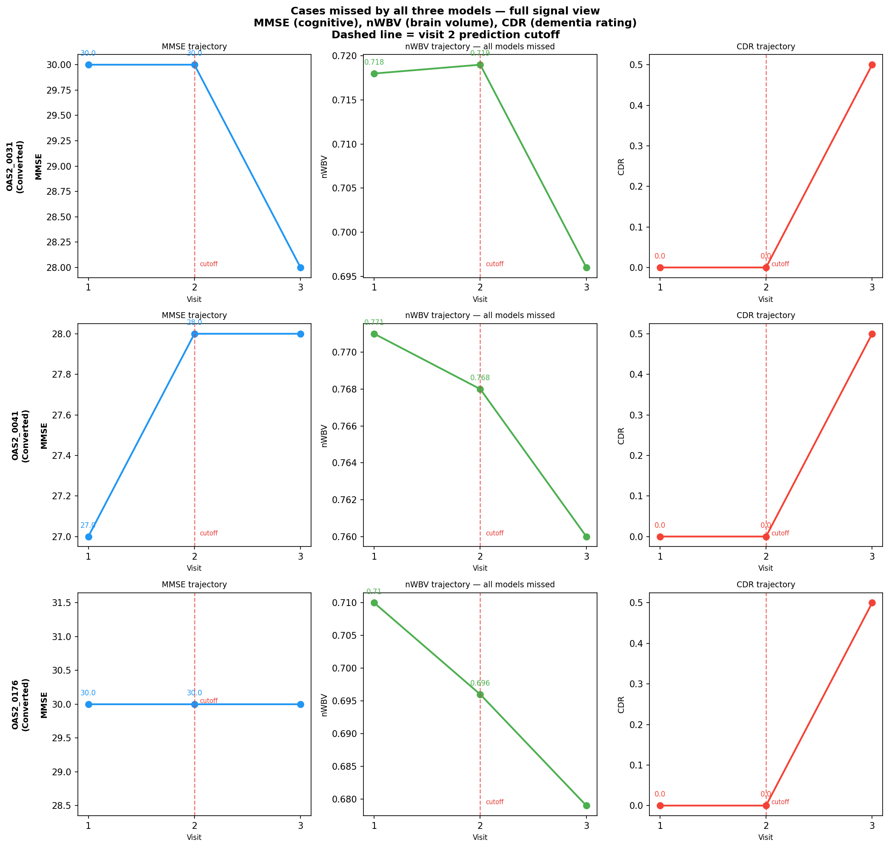

# Longitudinal Clinical Trial Prediction: Comparing LLM, XGBoost and a JEPA-inspired Architecture

A hands-on exercise comparing three fundamentally different approaches to longitudinal patient outcome prediction — built to understand how trajectory-based architectures differ structurally from language models and traditional machine learning.

---

## The Clinical Scenario

Imagine you are monitoring a 2-year Alzheimer's trial. It is month 14. You have visit 1 and visit 2 data for every participant. Which participants will have progressed by their final visit?

If you ask a language model, it reads a text description of the patient and matches it against everything it has learned from medical literature. If you use a model grounded in the patient's actual physiological trajectory — the rate their brain is atrophying, the slope of their cognitive scores — you are reasoning about what is physically happening to that specific person, not what typically happens to people who sound like them on paper.

This exercise tests that hypothesis using real longitudinal data from the OASIS-2 study — combining cognitive assessments (Mini-Mental State Examination - MMSE, Clinical Dementia Rating - CDR), brain imaging measurements (Normalized Whole-Brain Volume - nWBV, estimated Total Intracranial Volume - eTIV from Magnetic Resonance Imaging or MRI scans), and demographic information across multiple visits per participant.

---

## The Three Approaches

### LLM Baseline — OpenAI gpt-4o-mini
Each participant's visit 1 and visit 2 data is serialised into a structured text prompt. The model is asked to predict whether CDR will worsen by the final study visit. No training on our dataset — the model reasons entirely from its pre-training on medical literature and general knowledge.

**Structural limitation**: The LLM has no internal model of how Alzheimer's progression works physiologically in a specific patient. It matches the text description of this patient against patterns in its training data. It cannot reason about the rate and shape of physiological change — it sees a snapshot description.

**Non-determinism and hallucination**: Even at `temperature=0`, OpenAI does not guarantee identical outputs across runs. In a clinical monitoring system, sending the same patient data twice could produce different predictions — a serious reliability problem. More critically, LLMs can hallucinate: generate confident, clinically plausible reasoning that is factually constructed rather than grounded in the patient's actual data. A model might state "this trajectory is consistent with early-stage progression" based on pattern-matched text generation, not on what is measurably happening to this person. In high-stakes clinical contexts, a confidently wrong prediction with a fabricated rationale is more dangerous than a wrong prediction with no rationale.

### XGBoost Baseline
Trained on tabular features from visits 1 and 2 plus delta features (rate of change between visits). This is the honest benchmark — both other approaches need to be meaningfully compared against it.

**Structural limitation**: XGBoost treats all features as a flat table. It can learn that MMSE delta is predictive, but it has no structural understanding that MMSE and nWBV are different types of signals that should be reasoned about separately before being combined.

**Reproducibility**: Fully deterministic. Given the same data and `random_state=42`, XGBoost produces identical results on every run.

### JEPA-Inspired Joint Embedding Model — PyTorch
A multimodal longitudinal architecture with three modality-specific encoders (cognitive, brain structure, demographic), shared encoder weights across visits, and prediction in embedding space.

**Core architectural principle**: Visit 1 and visit 2 are encoded separately through shared-weight encoders, forcing the model to represent both visits in the same embedding space. The predictor then reasons about the relationship between the two visit embeddings — the trajectory — rather than from raw feature values. This is the JEPA principle applied to longitudinal clinical data: learn representations of states, then predict across states.

**Why not full JEPA**: A complete JEPA implementation would add a self-supervised pretraining objective — given visit 1's embedding, predict visit 2's embedding before seeing it. This requires thousands of longitudinal trajectories to learn meaningful representations. OASIS-2 yields only 52 usable participants under correct methodology, which is insufficient for self-supervised pretraining. The supervised implementation here preserves the architectural principle while acknowledging this limitation explicitly.

**Hallucination**: Not possible. The model takes numerical inputs, applies learned mathematical transformations, and outputs a probability. There is no generative component and no natural language reasoning. Its failure mode is being wrong — not being confidently wrong with a fabricated clinical rationale. This is a fundamental advantage of discriminative models over generative models in high-stakes prediction tasks.

**Reproducibility**: Deterministic on the same machine and PyTorch version via `torch.manual_seed(42)`. Minor numerical variations may occur across different hardware or PyTorch versions due to floating point differences.

---

## Dataset

### Real data — OASIS-2 Longitudinal
- 150 participants aged 60–96, 373 total imaging sessions
- 72 Nondemented, 64 Demented, 14 Converters (nondemented at baseline, developed AD during study)
- Variables per visit: MMSE, CDR, nWBV, eTIV, ASF, Age, Education, SES, Sex

**Source**: Marcus et al. 2010. Available on Kaggle — no approval required.

**Critical methodology note**: The prediction task requires at least 3 visits per participant — visits 1 and 2 as input, visit 3+ as ground truth. Only 52 of the 150 participants meet this requirement. Of those, only 3 have positive labels (CDR worsened after visit 2). This is insufficient for a meaningful train/test split.

### Synthetic augmentation
150 synthetic participants were generated from the real OASIS-2 statistical distributions to make the exercise executable. Key design decisions:

- Converters oversampled to 20% (vs 9% in real data) to ensure enough positive cases in both train and test sets
- Trajectories generated with group-appropriate MMSE decline rates, nWBV atrophy, and CDR progression logic
- All synthetic participants flagged with `synthetic=True` in the combined dataset
- Real participants forced into the test set to preserve genuine clinical evaluation cases

This augmentation is explicitly acknowledged here and in all result interpretations. Results on positive cases reflect a mix of synthetic and real trajectories. A real deployment would require a much larger longitudinal cohort such as OASIS-3.

### Final dataset
- 202 usable participants (52 real + 150 synthetic)
- 161 training, 43 test
- 11 positive cases in test set (3 real, 8 synthetic)

---

## How to Run

### Setup
```bash
git clone <repo>
cd jepa
python -m venv venv && source venv/bin/activate
pip install -r requirements.txt
```

Add your OpenAI API key to a `.env` file:
```
OPENAI_API_KEY=your_key_here
```

Download OASIS-2 from Kaggle and place at `data/raw/oasis_longitudinal.csv`.

### Pipeline

```bash
# Explore the real dataset
python main.py --step exploration

# Generate synthetic participants and combine with real data
python main.py --step synthetic

# Preprocess the augmented dataset
python main.py --step preprocessing --data-path data/raw/oasis_augmented.csv

# Run the three models
python main.py --step llm_baseline
python main.py --step ml_baseline
python main.py --step joint_embedding

# Compare results
python main.py --step comparison
```

---

## Results

### Metrics summary

| Model | AUC-ROC | Accuracy | Sensitivity | Specificity | F1 |
|---|---|---|---|---|---|
| LLM (gpt-4o-mini) | 0.632 | 0.674 | 0.545 | 0.719 | 0.462 |
| XGBoost | 0.710 | 0.767 | 0.455 | 0.875 | 0.500 |
| JEPA-inspired | 0.605 | 0.674 | 0.545 | 0.719 | 0.462 |

XGBoost has the best AUC and specificity. LLM and JEPA tie on sensitivity — catching the same number of worsening cases but with more false alarms than XGBoost. No model dominates across all metrics. Each architecture has a structural advantage in different situations.

### The three real converters — all models missed them

OAS2_0031, OAS2_0041, and OAS2_0176 are the three real converter participants in the test set. Every model predicted stable for all three. Looking at their visit 1 and visit 2 data explains why:

| Participant | MMSE V1→V2 | CDR V1→V2 | nWBV V1→V2 |
|---|---|---|---|
| OAS2_0031 | 30 → 30 | 0.0 → 0.0 | 0.718 → 0.719 |
| OAS2_0041 | 27 → 28 | 0.0 → 0.0 | 0.771 → 0.768 |
| OAS2_0176 | 30 → 30 | 0.0 → 0.0 | 0.710 → 0.696 |



There is no detectable signal in any of the three measured dimensions at the prediction cutoff. The conversion only became visible at visit 3 — after the cutoff. This is not a model failure. This is the fundamental difficulty of early Alzheimer's detection, and it is precisely why better architectures, more data modalities, and longer observation windows matter.

### Where models disagreed on positive cases

The most instructive cases are where models disagreed:

- **SYN_1105**: Only JEPA caught it — LLM and XGBoost both predicted stable
- **SYN_1131**: LLM and JEPA caught it — XGBoost predicted stable
- **SYN_1115**: XGBoost and JEPA caught it — LLM predicted stable

Each architecture catches something the others miss. This reflects genuine structural differences in how each approach reasons about the data, not random noise.

---

## Limitations

**Dataset size**: The real OASIS-2 data yields only 52 usable participants under correct 3-visit methodology. This is the honest constraint — not a preprocessing error.

**Synthetic data**: All positive cases in the evaluation are either synthetic or real participants whose conversion signal was not yet visible at the cutoff. Results should be interpreted as a proof-of-concept demonstration, not a clinical validation.

**JEPA early stopping**: The joint embedding model consistently stopped training early (epochs 19-24 of 100). With 135 training participants, there is insufficient data to fully exploit the trajectory encoding architecture. This is expected and consistent with the theoretical argument — JEPA-style architectures require more data to show their structural advantage.

**No self-supervised pretraining**: A full JEPA implementation would learn trajectory representations from unlabelled longitudinal data before supervised training. This layer was omitted due to dataset size constraints.

---

## What a Full Implementation Would Add

With a dataset like OASIS-3 (1000+ participants, PET scans, genetic data, more granular assessments):

- Self-supervised pretraining objective: given visit 1 embedding, predict visit 2 embedding before seeing it
- Additional modality encoders: PET amyloid burden, genetic risk (APOE4), sleep quality, gait
- The joint embedding architecture absorbs new modalities naturally — add an encoder stream, the rest of the architecture is unchanged. XGBoost would just receive more columns with no structural benefit from the new modalities.
- At scale, trajectory encoding would capture signals invisible to flat feature models: the shape of decline curves, interaction between brain atrophy rate and cognitive slope, early pre-symptomatic patterns

---

## Project Structure

```
jepa-vs-llm-oasis/
├── data/
│   ├── raw/
│   │   ├── oasis_longitudinal.csv       # Real OASIS-2 data (download from Kaggle)
│   │   └── oasis_augmented.csv          # Combined real + synthetic (generated)
│   └── processed/
│       ├── train_participants.csv
│       └── test_participants.csv
├── notebooks/
│   ├── 01_exploration.ipynb
│   ├── 02_preprocessing.ipynb
│   ├── 03_llm_baseline.ipynb
│   ├── 04_ml_baseline.ipynb
│   ├── 05_joint_embedding.ipynb
│   └── 06_comparison.ipynb
├── src/
│   ├── data_exploration.py
│   ├── synthetic_data.py
│   ├── preprocessing.py
│   ├── llm_predictor.py
│   ├── ml_baseline.py
│   ├── joint_embedding_model.py
│   └── evaluation.py
├── results/
│   ├── figures/
│   └── metrics_summary.csv
├── main.py
├── requirements.txt
└── .env.example
```

---

## References

Marcus, D.S., Fotenos, A.F., Csernansky, J.G., Morris, J.C., Buckner, R.L. (2010). Open Access Series of Imaging Studies: Longitudinal MRI Data in Nondemented and Demented Older Adults. *Journal of Cognitive Neuroscience*, 22(12), 2677–2684.

LeCun, Y. (2022). A Path Towards Autonomous Machine Intelligence. *OpenReview*.

---

*May 2026*
